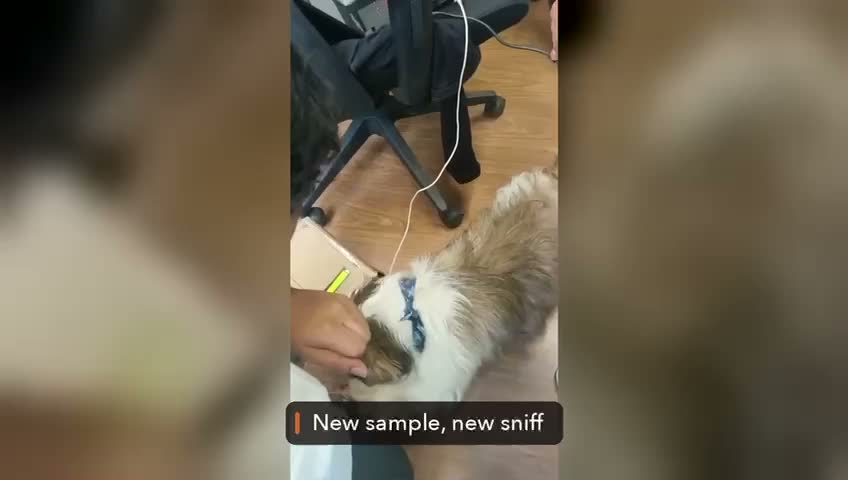

# PawLink

Assistance and medical-alert dogs can be trained to notice things going wrong with their handler — a drop in blood sugar, a seizure cue, a person becoming unresponsive — and to nudge, paw, bark, or fetch a phone in response. None of that goes anywhere if the handler can't act on it. PawLink turns that alert into a digital one: a dog presses a physical button, an LCD shows the word, and a signal goes out that a dashboard (and eventually a phone) can pick up, so help reaches someone even when the handler can't ask for it themselves.

This repo is the hackathon build: a three-button board (standing in for trained alert cues), ESP32-H2 firmware, and a local web dashboard that mirrors the display live and counts every press. Built at the Claude Creature Commons hackathon.

## Demo

[](demo/pawlink-demo.mp4)

Real dog, real hardware: the dog sniffs a sample and presses the paw button, the button signal reaches the handler. Click the image to play, or open [`demo/pawlink-demo.mp4`](demo/pawlink-demo.mp4) directly.

Full pitch deck: [Dogs Detect Cancer](https://drive.google.com/file/d/1Cp8qCkEWdsAFJ6dr2RyMs37CAXkAFpgC/view?usp=sharing).

## Hardware

- PCBCupid **Glyph H2** (ESP32-H2)
- 16x2 I2C LCD (PCF8574 backpack)
- 3 push buttons

### Wiring

| Part       | Glyph H2 pin |
|------------|--------------|
| LCD VCC    | 3.3V         |
| LCD GND    | GND          |
| LCD SDA    | IO4          |
| LCD SCL    | IO5          |
| Button 1   | IO10 → button → GND |
| Button 2   | IO11 → button → GND |
| Button 3   | IO12 → button → GND |

Buttons use the internal pull-ups (pressed = LOW). Avoid IO8/IO9 (strapping/BOOT), IO0 (onboard LED), IO23/24 (UART) and IO26/27 (USB). Pinout reference: [PCBCupid Glyph H2](https://learn.pcbcupid.com/documentation/modules/glyph/glyph-esp32h2/pinouts-h2).

## Repository layout

```
pawlink/                  Main firmware: buttons -> "cancer" / "diabetes" / "treats"
glyph_h2_lcd_buttons/     Hardware test sketch: LEFT/OK/RIGHT counter on the LCD
pawlink_web/              Local dashboard (Python server + HTML)
demo/                     Demo video
```

## Firmware

1. Install the ESP32 board package in the Arduino IDE and select the ESP32-H2 board.
2. Install the library **LiquidCrystal_PCF8574** (mathertel) for `pawlink.ino`. The test sketch uses **LiquidCrystal_I2C**.
3. Open `pawlink/pawlink.ino` and upload.

The sketch auto-detects the LCD's I2C address. Each word stays on screen for 3 seconds, then the display returns to "Press a button". Every LCD update is also printed to serial as `LCD:<text>` at 115200 baud, which the dashboard reads.

## Web dashboard

Requires Python 3.

```
cd pawlink_web
pip install -r requirements.txt
python server.py              # auto-detects the ESP32's COM port
python server.py --port COM8  # or pick it explicitly
```

Then open http://localhost:8000. On Windows you can double-click `start_pawlink.bat` instead.

Close the Arduino IDE Serial Monitor first, since only one program can hold the COM port. The server reconnects on its own if the board is unplugged.

Options: `--baud` (default 115200), `--http` (default 8000).

## Testing it

With the firmware uploaded and the dashboard server running:

1. Press each of the 3 buttons in turn.
2. Check the LCD shows the matching word for 3 seconds, then returns to "Press a button".
3. Check the dashboard at http://localhost:8000 mirrors the same word and increments that button's press count.

If the LCD updates but the dashboard doesn't, the serial port is probably still held by the Arduino IDE — close its Serial Monitor and restart `server.py`.

## License

MIT, see [LICENSE](LICENSE).
